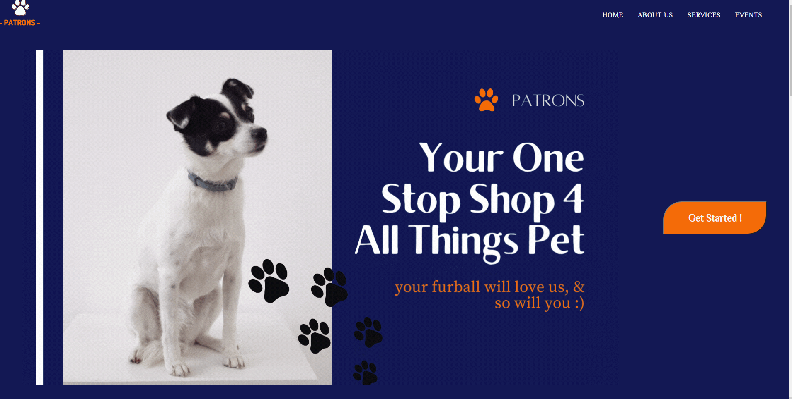
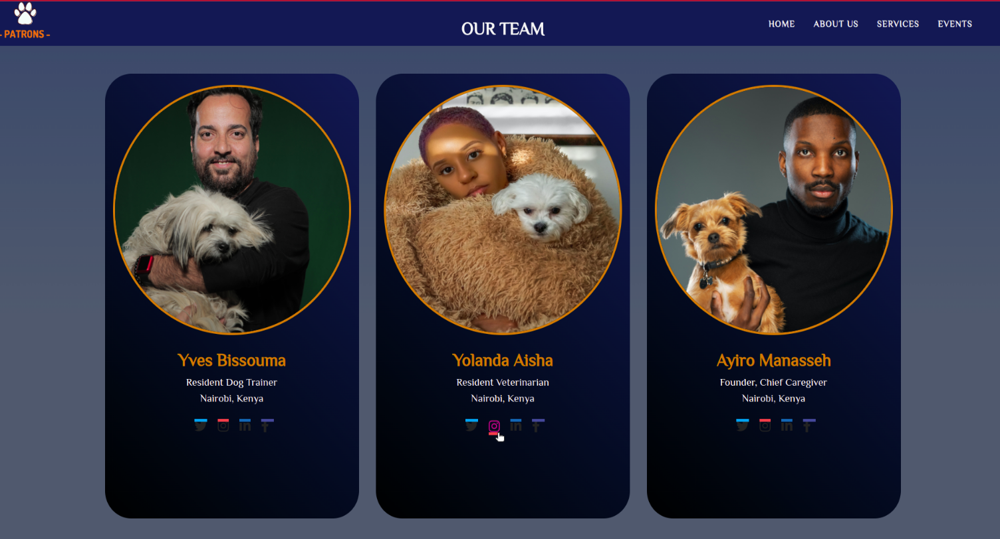
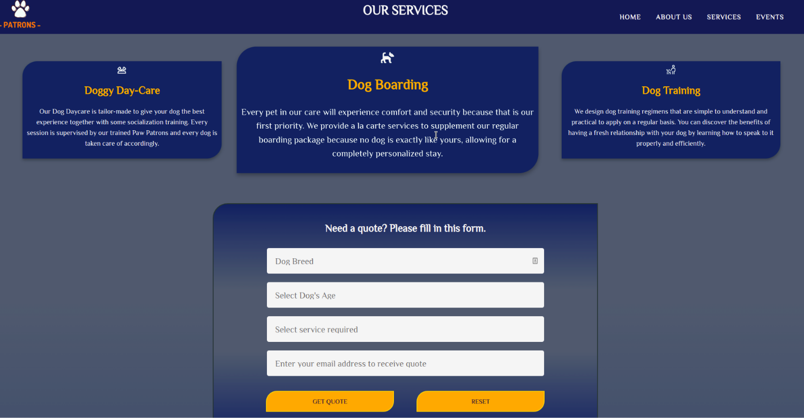
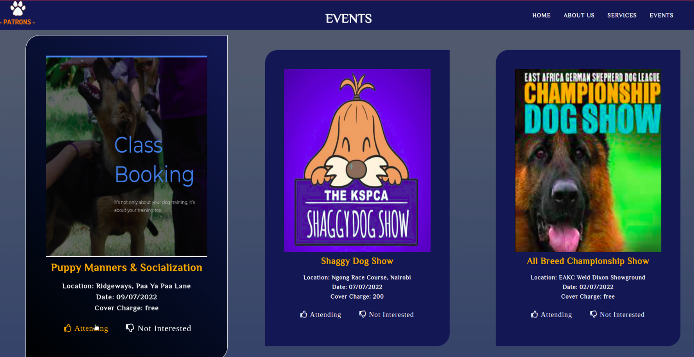

# PAW-PATRONS

---

### Author : IVY RONOH

---

## Project Description

Paw-Patrons is a pet services website that aims to ascertain the well-being of pets as well as their owners. This is my end of Phase-1 Independent Project built using HTML, CSS & JavaScript.
---

## SCREENSHOTS

## Landing Section

### 

## About Us Section

### 

## Our Services Section

### 

## Events Section

### 

***
## Table of content

- [Technologies](#description)
- [Description](#description)
- [Features](#features)
- [Live-link] (#  https://i-ronoh.github.io/Paw-Patrons/)
- [Setup-process](#setup_process)
- [Project-usage](#project-usage)
- [Licence](#licence)
- [Copyright](#copyright)

---

## Technologies

languages used are:

- HTML :HTML5 -which is used to create the structure of thr page
- CSS :CSS4 -used to style the page
- JavaScript:ES6 -used to code app backend and front end
- JSON : used as database

---

### Features

As a user you ase able to:
1 View Services Offered
2 view team member profiles
3 Interact with team members social media platforms
4 View dog services offered
5 Fill in form to get dog services quote
6 Future:  add or remove an event from the system

---

### description

This web application helps to solve the problem of of pet owners lacking the time and/or resources necessary to fulfill the attention and stimulation quota their furry friends require on the daily. These services are indeed very essential especially in the bid to curb the locking of pets in balconies- something that is extremely rampant in Nairobi suburbs.
This application is not only beneficial to pets, it is also a very handy tool for pet owners since it enables them to do thier work without the guilt of not having enough time to cater for their pets. 
In addition to this web application's ability to ensure the overall well-being of pets, it also has an event scheduler that allows for owner-pet bonding over fun-filled weekend activities. 

Go ahead and try Paw-Patrons today, your furball will thank us, & so will you! Tell a friend to tell a friend :)
---

### challenges

The major challenge I faced was incorporating likes and comments within the API.  
---

## How to set up and run the project

### Requirements

- [npm](https://www.npmjs.com/)
- Text editor eg [Visual Studio Code](https://code.visualstudio.com/download)

---

## Dependencies

- npm

---

#### setup

clone the repo using the command

- $git clone https://github.com/i-ronoh/Paw-Patrons.git
- change into directory using command
- `$cd clock-me`
- open the code in vs code with command
- `code .`
- install json server using the command
- `npm install -g json-server`
- start the json server
- `json-server --watch db.json`
- use live server to run the front end

---

## How to use the project

The project root folder contains three files, main **index.html**, **index.html** and **README.md** file and one folder assets folder. the assets folder within it are four folders **css** which contains css files and **media** folder which contains images, and **JS** which contains JavaScript files.

---

### Contributing to project

- Fork the repo

* Create a new branch in your terminal (git checkout -b improve-feature)
* Install the prerequisites
* Make appropriate changes in file(s)
* Run the server to see the changes
* Add the changes and commit them (git commit -am "Improve App")
* Push to the branch (git push origin improve-app)
* Create a Pull request

---

## Copyright

Copyright(c)[2022][Ivy Ronoh]

---

## Contact Information

- Email : ronoh.ivy@gmail.com

---

## [License](LICENSE)

MIT License
Copyright (c) 2022 Ivy Ronoh